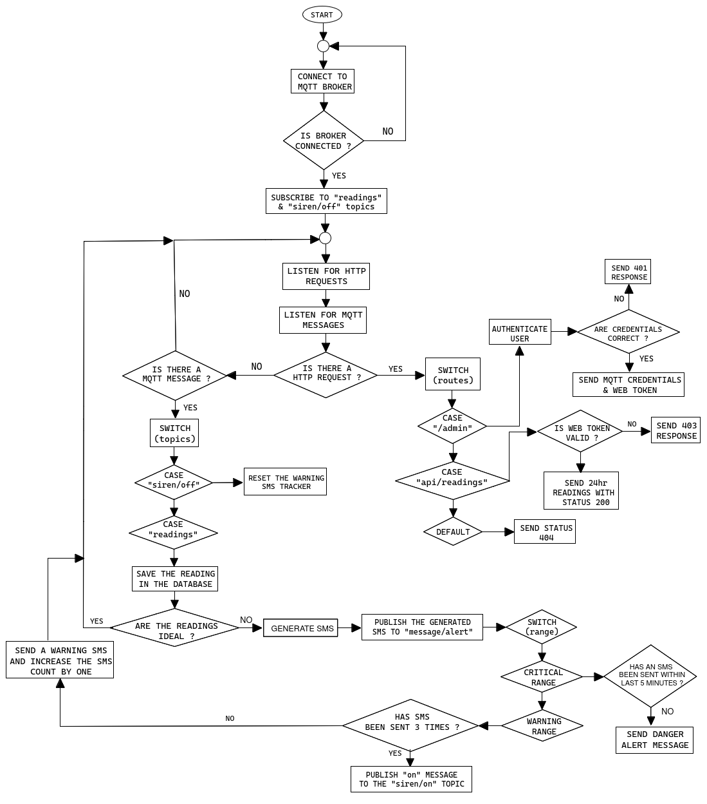

This is the server for my final year project

## What it does

- Authenticate users.
- Store hatchery readings sent by the microcontroller in the database.
- Retrieve the stored readings when the client app requests for them.
- Send critical and warning sms alerts using twilio whenever the reasings are not desirable.

## How it works

